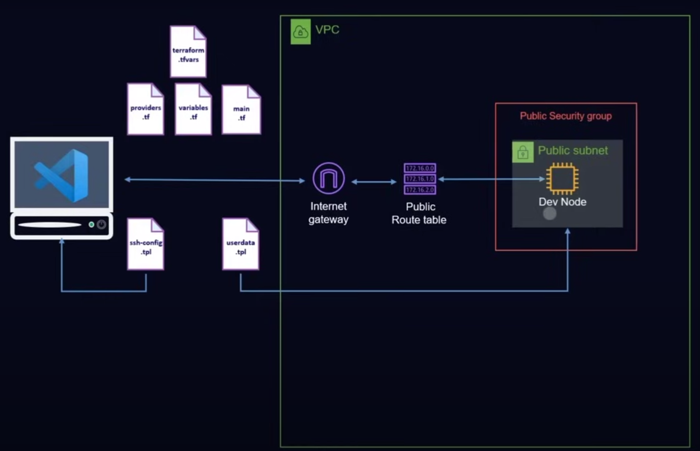
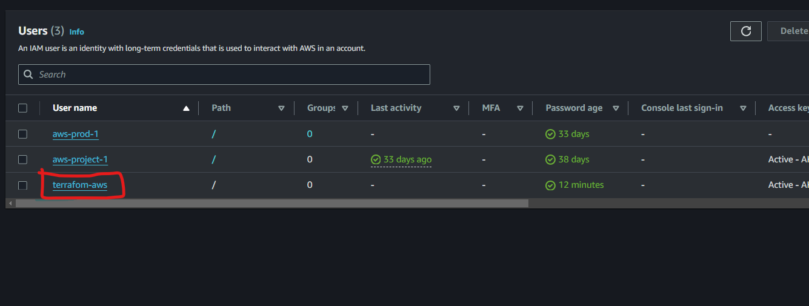

# Terraform Basic Server Setup

This project focuses on building a Dev Environment.

The Architecture for the following:

1. Setting up the IAM user for access (provider.tf):
    a. It strictly recommended not to use Access key and Secret Key of the 'Root user'.
    b. AWS console -> IAM -> Users -> Create User "name of the user" -> Attach Policies "AWS Adminitrator"->Create User
    c. After the User is created use spectate into Users List for the user.
        
    d. Select user -> Security credentials -> Create Access Key "Select your use for key" -> Download .csv file
    e. Access key and Secret key can be also be put in providers.tf file.
       https://registry.terraform.io/providers/hashicorp/aws/latest/docs 

2. Setting up a VPC (Virtual Private Cloud):
    a. Set the CIDR ipv4.
    b. Enable the DNS hostname and DNS Support.
    c. Domain Name System (DNS) is a standard by which names used on the internet are resolved to their corresponding IP addresses.
       A DNS hostname is a name that uniquely and absolutely names a computer; it's composed of a host name and a domain name.
       DNS servers resolve DNS hostnames to their corresponding IP addresses.
       https://registry.terraform.io/providers/hashicorp/aws/latest/docs/resources/vpc

3. Adding the Subnet to the VPC:
    a. A subnet is a range of IP addresses within a virtual private cloud (VPC). 
       Subnets make networks more efficient by allowing network traffic to travel shorter distances.
    b. Set up the VPC ID wrt to the VPC which has been created.
    c. Set the CIDR ipv4 address such that the Subnet is present inside the VPC
    d. Set the availability zone (Reccomended to use AZ where your IAM is setup).
       https://registry.terraform.io/providers/hashicorp/aws/latest/docs/resources/subnet

4. The Internet Gateway:
    a. An internet gateway is a horizontally scaled, redundant, and highly available VPC component that allows communication 
       between your VPC and the internet. 
       It supports IPv4 and IPv6 traffic. It does not cause availability risks or bandwidth constraints on your network traffic.
       An internet gateway enables resources in your public subnets (such as EC2 instances) to connect to the internet if the resource has a public IPv4 address or an IPv6 address. 
       Similarly, resources on the internet can initiate a connection to resources in your subnet using the public IPv4 address or IPv6 address. For example, an internet gateway enables you to connect to an EC2 instance in AWS using your local computer.
    b. Set up the VPC ID wrt to the VPC which has been created.
       https://registry.terraform.io/providers/hashicorp/aws/latest/docs/resources/internet_gateway

5. Setting up the Routes
    a.
    b. It is recommended to use route_table and route as different resources in order to avoid conflict.
    c. Create route_table resource and set VPC id.
       https://registry.terraform.io/providers/hashicorp/aws/latest/docs/resources/route_table
    d. Create the route resource and set the gateway id and route table id.
       https://registry.terraform.io/providers/hashicorp/aws/latest/docs/resources/route
    e. Route table association with the subnet.